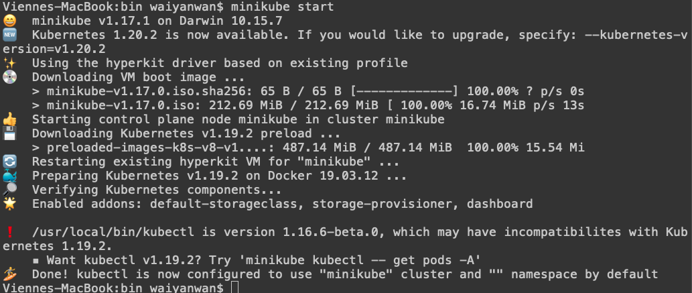
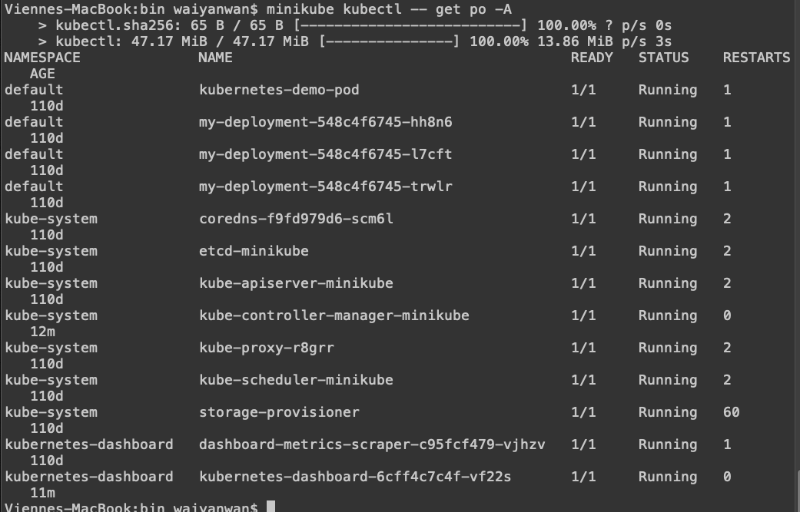
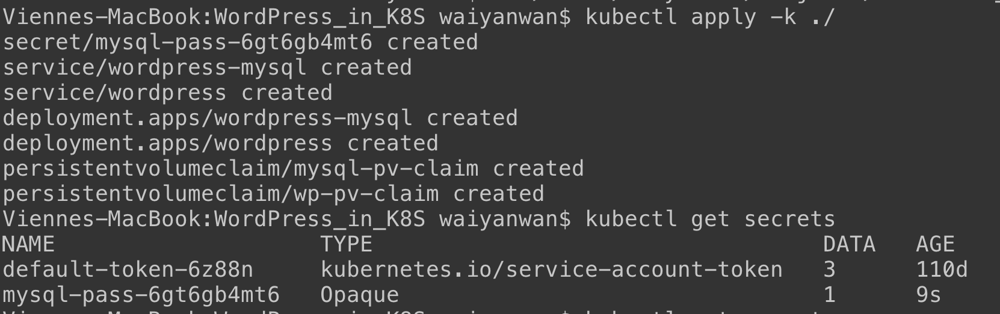
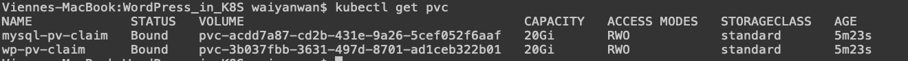
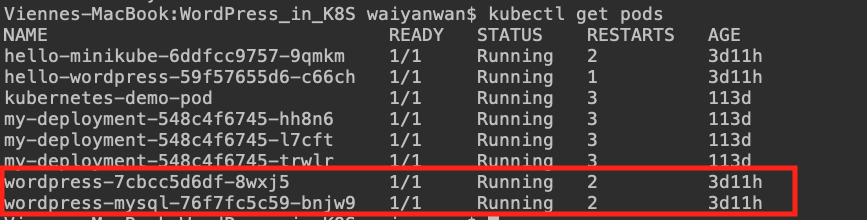
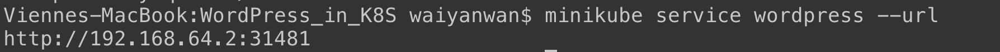
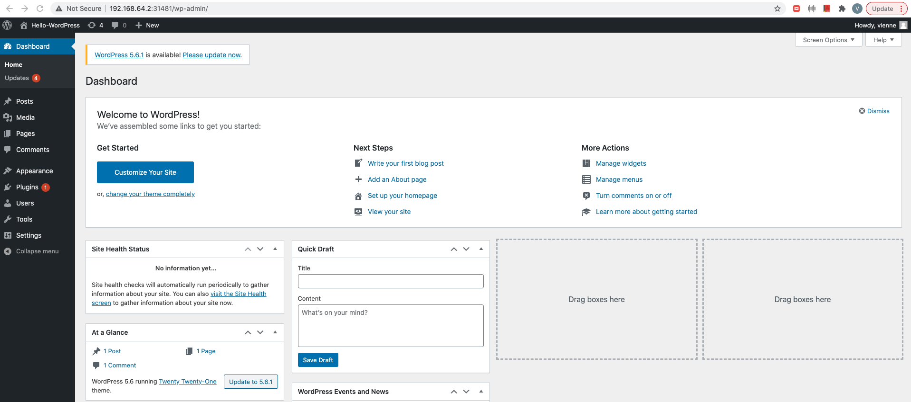
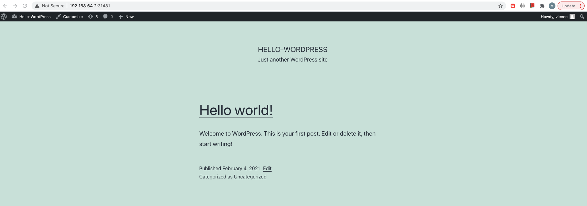

# WordPress In Kubernetes

## Minikube

Minikube is a tool to run Kubernetes locally. It runs single-node cluster.

### Install by Bash on Mac

```shell
curl -LO https://storage.googleapis.com/minikube/releases/latest/minikube-darwin-amd64
sudo install minikube-darwin-amd64 /usr/local/bin/minikube
```

### Start Cluster

```shell
minikube start
```



## Kubectl

Kubectl is used to deploy and manage clusters resources.

### Install Kubectl

```shell
minikube kubectl -- get po -A
```



### Create yaml files

- kustomization.yaml, includes resources file which contains pod deployment  information.

- wordpress-deployment.yaml, in which I used wordpress:5.6-apache from DockerHub.
- mysql-deployment.yaml, provide db for wordpress

### Create deployment

```shell
kubectl apply -k ./
```





Once deployment is created, corresponding wordpress pod will be deployed into the cluster. We now can see the pods are running.

```
kubectl get pods
```



```
kubectl get services wordpress
```

```
minikube service wordpress --url
```



Browse http://192.168.64.2:31481/wp-admin/



Browse http://192.168.64.2:31481/



